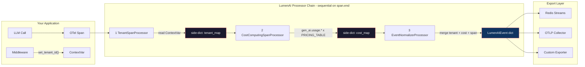
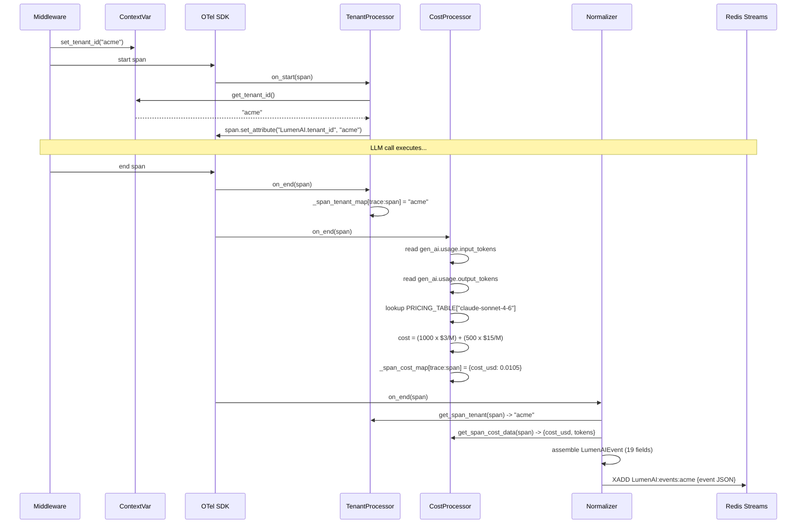
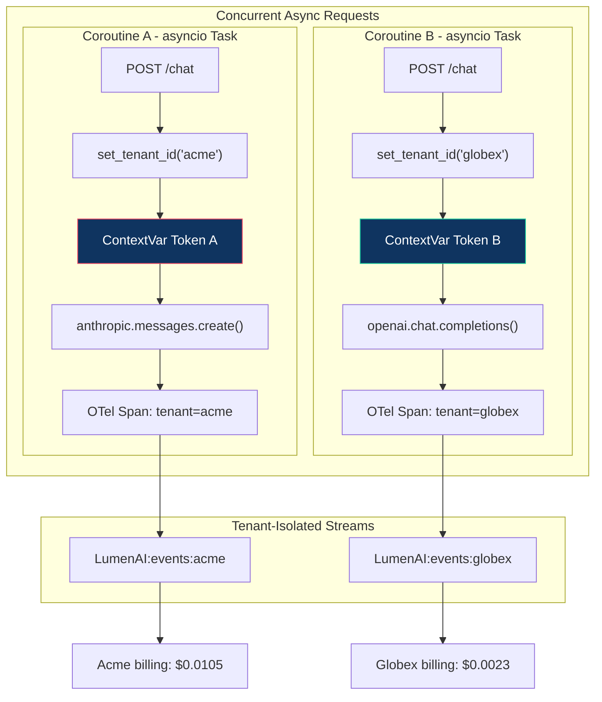
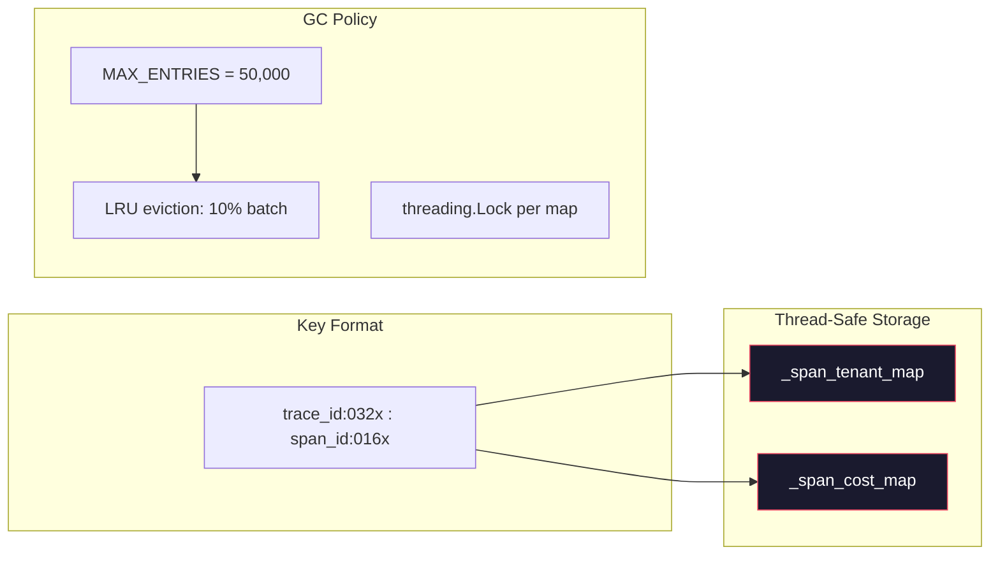
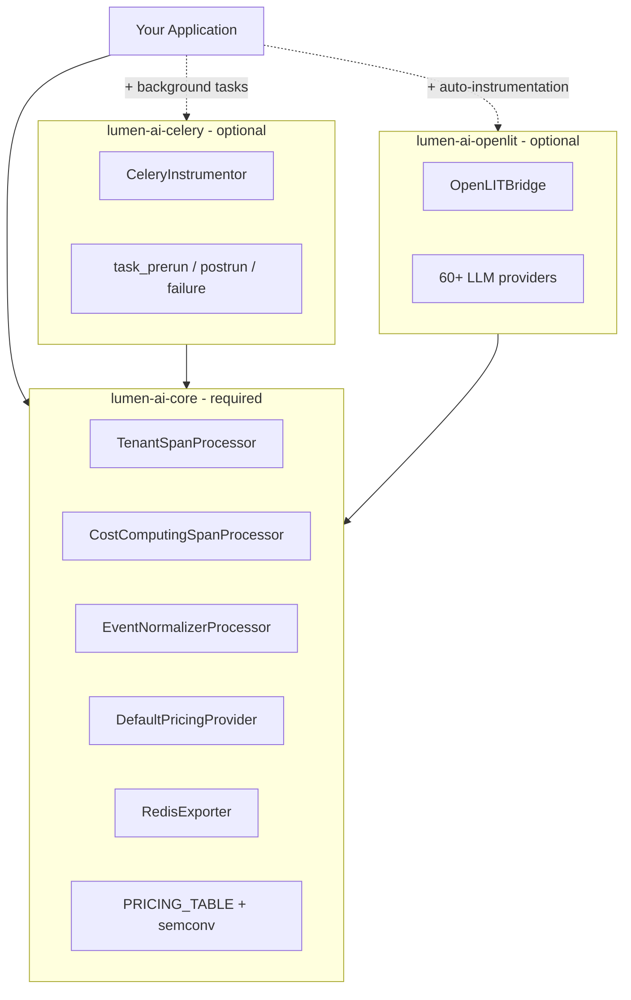

<div align="center">

# LumenAI SDK


**Real-time FinOps & Multi-Tenant Observability for Generative AI**

[](https://github.com/skarL007/-lumen-ai-sdk)
[](LICENSE)
[](https://www.python.org/)
[](https://opentelemetry.io/)
[](https://github.com/skarL007/-lumen-ai-sdk/actions)
[](https://pypi.org/project/lumen-ai-core/)
[](https://github.com/sponsors/skarL007)
[](https://github.com/skarL007/-lumen-ai-sdk/stargazers)

---

> *"You can't optimize what you can't measure. You can't bill what you can't isolate."*

---

[Interactive Demo](https://skarL007.github.io/-lumen-ai-sdk/lumen-demo.html) &nbsp;·&nbsp;
[Report Bug](https://github.com/skarL007/-lumen-ai-sdk/issues/new?template=bug_report.md) &nbsp;·&nbsp;
[Sponsor](https://github.com/sponsors/skarL007) &nbsp;·&nbsp;
[Discord: skar1v9](https://discord.com/users/skar1v9)

</div>

---

## The Problem

You shipped an AI feature last month. This morning you opened your cloud invoice.

> **$4,847.23** in LLM API costs. For a single week.

You have no idea which tenant caused the spike. You have no idea which agent ran 11,000 times. You have no idea whether `claude-opus-4-6` ($15/M input) was firing where `claude-haiku-4-5` ($0.25/M input) would have worked just as well. Your logs say `"LLM call completed"`. That is all.

Standard observability tools were not built for the economics of generative AI. OTel gives you traces but no USD cost. Logging gives you messages but no token accounting. Multi-tenant SaaS means costs are pooled but contracts are per-customer.

**LumenAI fixes this.** Drop it into your existing OpenTelemetry setup, call `LumenAI.init()` once, and every AI span automatically gains:

- Tenant attribution — which customer triggered this call
- Real-time USD cost — down to 8 decimal places, per span
- Canonical event normalization — one schema for every provider
- Redis Streams delivery — queryable by tenant, by model, by time

No prompt logging. No PII. Pure metadata. One function call.

---

## Why LumenAI?

| Feature | Plain OTel | Custom Logging | Langfuse | OpenLIT Standalone | **LumenAI** |
|---|---|---|---|---|---|
| USD cost per span | No | Manual | Partial | Provider-dependent | **Built-in pricing table** |
| Multi-tenant isolation | No | Manual | Via project | No | **ContextVar-native, async-safe** |
| FastAPI / async safe | Yes | Risky | Depends | Yes | **Yes — zero-copy ContextVar propagation** |
| Celery support | No | Manual | No | No | **Signal hooks, zero task code changes** |
| Custom exporters | OTLP only | Anything | No | No | **ABC — Postgres, ClickHouse, Kafka, anything** |
| Prompt logging | No | If you want | Yes | Yes | **No — privacy by design** |
| License | Apache | N/A | AGPL | Apache | **MIT** |
| Self-hostable | Yes | Yes | Yes | Yes | **Yes** |
| PyPI | N/A | N/A | Yes | Yes | **Yes** |

---

## How It Works

LumenAI inserts three lightweight processors into your existing OTel `TracerProvider`:

1. **`TenantSpanProcessor`** reads a Python `ContextVar` (set by your middleware) and stamps every span with `LumenAI.tenant_id`. If no tenant is in context, it falls back to the configured default. Thread-safe, async-safe, zero allocations on the hot path.

2. **`CostComputingSpanProcessor`** fires on every `span.end()`. It reads `gen_ai.usage.input_tokens`, `gen_ai.usage.output_tokens`, and `gen_ai.usage.cache_read.input_tokens` from the span, looks up the model in the pricing table, and stores the computed USD cost in a side-dict keyed by `trace_id:span_id`.

3. **`EventNormalizerProcessor`** runs last. It reads the tenant and cost from the upstream side-dicts, assembles a canonical `LumenAIEvent` dict (19 typed fields), and calls your configured exporter — default: Redis Streams, keyed as `LumenAI:events:{tenant_id}`.

Your app code is never touched. Your prompts are never read. The entire pipeline adds roughly 50–200 microseconds per span.

---

## Architecture

### Pipeline



### Span Lifecycle



### Multi-Tenant Isolation



### Side-Dict Architecture



### Package Structure



---

## Installation

### From PyPI

```bash
# Core (always required)
pip install lumen-ai-core

# Optional: Celery instrumentation
pip install lumen-ai-celery

# Optional: OpenLIT bridge (auto-instruments 60+ LLM providers)
pip install lumen-ai-openlit
```

### From Git (development)

```bash
pip install "lumen-ai-core @ git+https://github.com/skarL007/-lumen-ai-sdk.git#subdirectory=packages/lumen-ai-core"
```

### Local Development

```bash
git clone https://github.com/skarL007/-lumen-ai-sdk.git
cd -lumen-ai-sdk
pip install -e packages/lumen-ai-core
pip install -e packages/lumen-ai-celery   # optional
pip install -e packages/lumen-ai-openlit  # optional
pip install pytest
pytest tests/test_smoke.py -v
```

---

## Quick Start

### Minimal (5 lines)

```python
from lumen_ai import LumenAI
from lumen_ai.processors.tenant import lumen_tenant

LumenAI.init(service_name="my-agent", redis_url="redis://localhost:6379/0")

with lumen_tenant("client-abc"):
    response = call_your_llm(prompt)  # span automatically tagged + costed
```

### Full FastAPI Middleware Example

```python
# main.py
from contextlib import asynccontextmanager
from fastapi import FastAPI, Request
from lumen_ai import LumenAI
from lumen_ai.processors.tenant import set_tenant_id, _current_tenant


@asynccontextmanager
async def lifespan(app: FastAPI):
    # Initialize once at startup — subsequent calls are ignored
    LumenAI.init(
        service_name="my-saas-api",
        redis_url="redis://localhost:6379/0",
        default_tenant="anonymous",
    )
    yield
    # Graceful shutdown — flushes all pending spans and closes Redis connection
    LumenAI.shutdown()


app = FastAPI(lifespan=lifespan)


@app.middleware("http")
async def tenant_middleware(request: Request, call_next):
    """
    Extract tenant from JWT or header and set the ContextVar.

    Every OTel span created within this request — including those emitted
    by OpenLIT-instrumented LLM libraries — will automatically carry the
    correct tenant_id with no additional code.
    """
    # In production: decode your JWT and extract the tenant claim
    tenant_id = request.headers.get("X-Tenant-ID", "anonymous")

    # set_tenant_id returns a Token for clean reset on exit
    token = set_tenant_id(tenant_id)
    try:
        response = await call_next(request)
        return response
    finally:
        # Always reset — prevents tenant context bleed between concurrent requests
        _current_tenant.reset(token)


@app.post("/api/v1/chat")
async def chat(request: Request):
    # tenant_id is already set in the ContextVar by the middleware above.
    # No extra code needed here — just call your LLM normally.
    result = await run_your_agent(request)
    return result
```

### With OpenLIT (auto-instrument 60+ providers)

```python
from lumen_ai import LumenAI
from lumen_ai_openlit import OpenLITBridge

LumenAI.init(
    service_name="my-agent",
    redis_url="redis://localhost:6379/0",
    instrumentors=[OpenLITBridge()],
)

# Every anthropic / openai / ollama call is now automatically traced,
# costed, and tenant-tagged. No changes to calling code.
import anthropic
client = anthropic.Anthropic()
message = client.messages.create(
    model="claude-sonnet-4-6",
    max_tokens=1024,
    messages=[{"role": "user", "content": "Hello"}],
)
# ^ cost_usd computed, tenant_id stamped, event in Redis Streams
```

### With Celery

```python
# worker.py
from lumen_ai import LumenAI
from lumen_ai_celery import CeleryInstrumentor

LumenAI.init(
    service_name="my-celery-worker",
    redis_url="redis://localhost:6379/0",
    instrumentors=[CeleryInstrumentor()],
)

# All Celery tasks now emit spans automatically via signal hooks.
# Pass tenant_id as a task kwarg — CeleryInstrumentor reads it and
# stamps the span. No @task decorator changes required.
@celery_app.task(name="tasks.research.run")
def run_research(investigation_id: str, tenant_id: str):
    ...
```

---

## API Reference

### `LumenAI.init()`

The process-level bootstrap. Call once at application startup. Subsequent calls are silently no-ops (a warning is logged).

| Parameter | Type | Default | Description |
|---|---|---|---|
| `service_name` | `str` | `"lumen-ai"` | OTel `service.name` resource attribute. Appears in traces and dashboards. |
| `otlp_endpoint` | `Optional[str]` | `None` | gRPC endpoint for raw OTLP span export (e.g. `"http://localhost:4317"`). |
| `redis_url` | `Optional[str]` | `None` | Redis connection URL. Automatically creates a `RedisExporter`. Mutually exclusive with `exporter`. |
| `default_tenant` | `str` | `"default"` | Fallback `tenant_id` for spans where no ContextVar is set. Never empty — must be a non-empty string. |
| `enable_otlp` | `bool` | `False` | Forward raw spans to the OTLP collector in addition to the LumenAI pipeline. Requires `otlp_endpoint`. |
| `pricing_provider` | `Optional[BasePricingProvider]` | `None` | Custom pricing source. Defaults to `DefaultPricingProvider` backed by the built-in `PRICING_TABLE`. |
| `exporter` | `Optional[BaseLumenAIExporter]` | `None` | Custom event sink. If `None` and `redis_url` is set, `RedisExporter` is created automatically. |
| `instrumentors` | `Optional[List]` | `None` | List of `BaseInstrumentor` instances. Activated in order. Failures are logged but do not abort init. |

### `LumenAI.shutdown()`

Flushes all pending spans, shuts down the `TracerProvider`, calls `shutdown()` on the registered exporter, and calls `uninstrument()` on all instrumentors. Safe to call from a `lifespan` context manager or `atexit` handler.

### `LumenAI.is_initialized()`

Returns `True` if `LumenAI.init()` has been called successfully. Useful for health checks and conditional initialization guards.

### Tenant Context API

```python
from lumen_ai.processors.tenant import (
    set_tenant_id,    # Set tenant for current async context; returns reset Token
    get_tenant_id,    # Read current tenant from ContextVar
    lumen_tenant,     # Context manager — sets on entry, resets on exit
    clear_tenant_id,  # Reset tenant to empty string in current context
)
```

| Function | Signature | Description |
|---|---|---|
| `set_tenant_id` | `(tenant_id: str) -> Token` | Set tenant for the current async context. Returns a `ContextVar.Token` for manual reset. Strips whitespace. |
| `get_tenant_id` | `() -> str` | Read the current tenant. Returns `""` if not set. |
| `lumen_tenant` | `(tenant_id: str) -> ContextManager` | Context manager. Sets tenant on entry, resets to the previous value on exit. Async-safe. |
| `clear_tenant_id` | `() -> None` | Reset tenant to empty string in the current context. |

---

## Event Schema

Every span processed by LumenAI produces one canonical event dict. This is the struct written to Redis Streams and passed to custom exporters.

| Field | Type | Source | Description |
|---|---|---|---|
| `id` | `str` (UUID4) | Generated | Unique event identifier. Never duplicated. |
| `tenant_id` | `str` | ContextVar / span attr / default | Which tenant owns this event. Never null — falls back to `default_tenant`. |
| `session_id` | `str` | `LumenAI.session_id` span attr | Optional session grouping (e.g. a user conversation or agent run). |
| `agent_id` | `str` | `LumenAI.agent_id` span attr | Optional agent identifier within a session. |
| `trace_id` | `str` (hex32) | OTel context | 32-character hex trace ID from the OTel span context. |
| `span_id` | `str` (hex16) | OTel context | 16-character hex span ID from the OTel span context. |
| `timestamp` | `str` (ISO 8601) | Generated at export | UTC timestamp of event creation in `EventNormalizerProcessor`. |
| `event_type` | `str` | Inferred from span kind + status | One of: `llm_call_completed`, `llm_call_failed`, `tool_call_completed`, `tool_call_failed`, `agent_completed`, `agent_failed`, `task_completed`, `task_failed`. |
| `severity` | `str` | OTel span error status | `"INFO"` for successful spans, `"ERROR"` for spans with `StatusCode.ERROR`. |
| `message` | `str` | `span.name` | Human-readable span name (e.g. `"anthropic.messages.create"`). |
| `duration_ms` | `int` | `span.end_time - span.start_time` | Wall-clock duration in milliseconds, computed from OTel nanosecond timestamps. |
| `is_error` | `bool` | OTel `StatusCode.ERROR` | `True` if the span ended with an error status code. |
| `cost_usd` | `float` | `CostComputingSpanProcessor` | Computed USD cost rounded to 8 decimal places. `0.0` if model unknown or tokens are zero. |
| `tokens_in` | `int` | `gen_ai.usage.input_tokens` | Input / prompt token count read from OTel GenAI semantic conventions. |
| `tokens_out` | `int` | `gen_ai.usage.output_tokens` | Output / completion token count. |
| `cache_read_tokens` | `int` | `gen_ai.usage.cache_read.input_tokens` | Cache-read token count (Anthropic prompt caching). Contributes to cost at the cache_read rate. |
| `model` | `str` | `gen_ai.request.model` or `gen_ai.response.model` | Model identifier as reported by the instrumentation (e.g. `"claude-sonnet-4-6"`). |
| `tool_name` | `str` | `gen_ai.tool.name` | Tool name for `TOOL` kind spans. Empty for LLM and AGENT spans. |
| `span_kind` | `str` | `openinference.span.kind` | OpenInference kind: `LLM`, `AGENT`, `TOOL`, `CHAIN`, `EMBEDDING`, `RETRIEVER`, `RERANKER`. |

---

## Pricing Providers

### Built-in Pricing Table

LumenAI ships with a static pricing table covering the most common models. All prices are **per 1 million tokens (USD)**:

| Provider | Model | Input $/M | Output $/M | Cache Read $/M |
|---|---|---|---|---|
| Anthropic | `claude-opus-4-6` | $15.00 | $75.00 | $1.50 |
| Anthropic | `claude-sonnet-4-6` | $3.00 | $15.00 | $0.30 |
| Anthropic | `claude-haiku-4-5` | $0.25 | $1.25 | $0.025 |
| DeepSeek | `deepseek/deepseek-v3.2` | $0.26 | $0.40 | $0.026 |
| DeepSeek | `deepseek/deepseek-r1` | $0.70 | $2.50 | $0.07 |
| Google | `google/gemini-2.5-pro` | $1.25 | $10.00 | $0.125 |
| Google | `google/gemini-2.5-flash-lite` | $0.10 | $0.40 | $0.01 |
| OpenAI | `openai/text-embedding-3-small` | $0.02 | $0.00 | $0.00 |
| Ollama | `ollama/gemma3:12b` | $0.00 | $0.00 | $0.00 |
| Ollama | `ollama/gemma3:1b` | $0.00 | $0.00 | $0.00 |
| Ollama | `ollama/nomic-embed-text` | $0.00 | $0.00 | $0.00 |

The pricing engine supports **partial model name matching**. A span with model `"anthropic/claude-sonnet-4-6"` correctly resolves to the `"claude-sonnet-4-6"` entry. This makes LumenAI compatible with OpenRouter-style model strings out of the box.

Want to add a model? See [Contributing — Update Pricing Table](CONTRIBUTING.md) — it takes about 2 minutes.

### `CommunityPricingProvider`

Fetches prices from a remote JSON URL (e.g. a GitHub Gist), refreshing every hour. This enables community-driven price updates without redeploying your application:

```python
from lumen_ai.providers import CommunityPricingProvider
from lumen_ai import LumenAI
from lumen_ai.schema.semconv import PRICING_TABLE

LumenAI.init(
    service_name="my-agent",
    redis_url="redis://localhost:6379/0",
    pricing_provider=CommunityPricingProvider(
        url="https://gist.githubusercontent.com/your-org/abc123/raw/pricing.json",
        fallback_table=PRICING_TABLE,  # Used if the URL is unreachable at startup
    ),
)
```

The remote JSON must match the schema: `{"model-id": {"input": float, "output": float, "cache_read": float}, ...}`.

### Custom `BasePricingProvider`

Implement your own to pull prices from a database, config service, or secrets manager:

```python
from lumen_ai.providers import BasePricingProvider
from typing import Optional, Dict

class DatabasePricingProvider(BasePricingProvider):
    """Fetches model prices from a PostgreSQL table — always up to date."""

    def __init__(self, db_session):
        self._db = db_session

    def get_pricing(self, model: str) -> Optional[Dict[str, float]]:
        row = self._db.query(ModelPricing).filter_by(model_id=model).first()
        if not row:
            return None
        return {
            "input": row.input_usd_per_million,
            "output": row.output_usd_per_million,
            "cache_read": row.cache_read_usd_per_million,
        }
```

---

## Exporters

### Built-in: `RedisExporter`

Writes normalized events to Redis Streams, one stream per tenant:

```
LumenAI:events:client-abc  →  XADD (JSON-serialized event, maxlen=10000)
LumenAI:events:client-xyz  →  XADD (JSON-serialized event, maxlen=10000)
```

Enabled automatically when you pass `redis_url` to `LumenAI.init()`. You can also instantiate it directly with a custom stream prefix:

```python
from lumen_ai.providers import RedisExporter

exporter = RedisExporter(
    redis_url="redis://localhost:6379/0",
    stream_prefix="myapp:ai-events",  # default: "LumenAI:events"
)
```

### Custom Exporter: PostgreSQL

```python
import psycopg2
from lumen_ai.providers import BaseLumenAIExporter

class PostgresExporter(BaseLumenAIExporter):
    """Writes LumenAI events to a PostgreSQL table for SQL-based analytics."""

    def __init__(self, dsn: str):
        self._conn = psycopg2.connect(dsn)
        self._conn.autocommit = True

    def export(self, tenant_id: str, event: dict) -> None:
        with self._conn.cursor() as cur:
            cur.execute(
                """
                INSERT INTO lumenai_events
                    (id, tenant_id, event_type, model, cost_usd,
                     tokens_in, tokens_out, duration_ms, is_error, timestamp)
                VALUES
                    (%(id)s, %(tenant_id)s, %(event_type)s, %(model)s,
                     %(cost_usd)s, %(tokens_in)s, %(tokens_out)s,
                     %(duration_ms)s, %(is_error)s, %(timestamp)s)
                ON CONFLICT (id) DO NOTHING
                """,
                event,
            )

    def shutdown(self) -> None:
        self._conn.close()
```

### Custom Exporter: ClickHouse (high-volume analytics)

```python
from clickhouse_driver import Client
from lumen_ai.providers import BaseLumenAIExporter

class ClickHouseExporter(BaseLumenAIExporter):
    """Batched write to ClickHouse for sub-second analytics at millions of events/day."""

    def __init__(self, host: str, database: str = "lumenai", batch_size: int = 100):
        self._client = Client(host=host)
        self._database = database
        self._batch_size = batch_size
        self._buffer: list[dict] = []

    def export(self, tenant_id: str, event: dict) -> None:
        self._buffer.append(event)
        if len(self._buffer) >= self._batch_size:
            self._flush()

    def _flush(self) -> None:
        if not self._buffer:
            return
        self._client.execute(
            f"INSERT INTO {self._database}.events VALUES",
            self._buffer,
        )
        self._buffer.clear()

    def shutdown(self) -> None:
        self._flush()
        self._client.disconnect()
```

---

## Integrations

### FastAPI — Middleware Pattern

The canonical pattern: one middleware sets `set_tenant_id()`, all routes are covered automatically.

```python
from fastapi import FastAPI, Request
from lumen_ai.processors.tenant import set_tenant_id, _current_tenant

app = FastAPI()

@app.middleware("http")
async def tenant_middleware(request: Request, call_next):
    # Replace this with your actual JWT / session extraction logic
    tenant_id = extract_tenant_from_jwt(request.headers.get("Authorization", ""))
    token = set_tenant_id(tenant_id or "anonymous")
    try:
        return await call_next(request)
    finally:
        # Always reset — prevents tenant bleed across concurrent coroutines
        _current_tenant.reset(token)
```

Every OTel span created during the request lifecycle — including library-level spans from OpenLIT — inherits the tenant from the ContextVar. No changes to route handlers required.

### Celery — Signal Hooks

`CeleryInstrumentor` connects to three Celery signals (`task_prerun`, `task_postrun`, `task_failure`) and creates OTel spans around task execution. It reads `tenant_id` from task kwargs automatically.

```python
# At worker startup
from lumen_ai import LumenAI
from lumen_ai_celery import CeleryInstrumentor

LumenAI.init(
    service_name="my-worker",
    redis_url="redis://localhost:6379/0",
    instrumentors=[CeleryInstrumentor()],
)

# In your tasks — pass tenant_id as a kwarg, nothing else changes
@celery_app.task(name="tasks.research.run")
def run_research(investigation_id: str, tenant_id: str, job_id: str):
    # The span wrapping this task is automatically tagged with tenant_id
    ...
```

### OpenLIT — 60+ Provider Auto-Instrumentation

`OpenLITBridge` calls `openlit.init()` with the LumenAI `TracerProvider`, routing all OpenLIT-generated spans through the LumenAI processor chain.

```python
from lumen_ai import LumenAI
from lumen_ai_openlit import OpenLITBridge

LumenAI.init(
    service_name="my-llm-app",
    redis_url="redis://localhost:6379/0",
    instrumentors=[
        OpenLITBridge(
            collect_gpu_stats=False,
            disable_batch=False,
        )
    ],
)

# Now instruments: Anthropic, OpenAI, Ollama, Cohere, Mistral, Groq,
# LiteLLM, LangChain, LlamaIndex, and 50+ more automatically.
```

---

## Use Cases

### 1. Per-Tenant Billing

Aggregate costs from Redis Streams at the end of each billing period and charge customers accurately:

```python
import redis
import json
from datetime import datetime, timedelta, timezone

def get_tenant_cost_window(
    tenant_id: str,
    redis_url: str,
    days: int = 30,
) -> float:
    """Sum USD cost for a tenant over the last N days."""
    r = redis.Redis.from_url(redis_url, decode_responses=True)
    stream_key = f"LumenAI:events:{tenant_id}"

    cutoff = datetime.now(timezone.utc) - timedelta(days=days)
    cutoff_ms = int(cutoff.timestamp() * 1000)

    # XRANGE returns entries from cutoff to present
    entries = r.xrange(stream_key, min=f"{cutoff_ms}-0", max="+")

    total_cost = sum(
        json.loads(fields["data"]).get("cost_usd", 0.0)
        for _, fields in entries
    )
    return round(total_cost, 6)


# In your monthly billing job:
for tenant in get_all_active_tenants():
    cost_usd = get_tenant_cost_window(tenant.id, redis_url, days=30)
    if cost_usd > 0.001:  # Skip rounding dust
        stripe.billing.meter_events.create(
            event_name="ai_spend",
            payload={"value": str(cost_usd), "stripe_customer_id": tenant.stripe_id},
        )
```

### 2. Budget Guardrail

Stop a tenant from running LLM calls once they have exceeded their monthly plan limit:

```python
from fastapi import HTTPException
from lumen_ai.processors.tenant import lumen_tenant

PLAN_LIMITS_USD = {"free": 5.0, "pro": 100.0, "enterprise": float("inf")}

async def run_ai_with_budget_check(tenant_id: str, plan: str, prompt: str):
    """Run an LLM call only if the tenant has budget remaining."""
    budget = PLAN_LIMITS_USD.get(plan, 5.0)
    spent = await get_tenant_cost_window_async(tenant_id, days=30)

    if spent >= budget:
        raise HTTPException(
            status_code=429,
            detail=(
                f"Monthly AI budget exhausted "
                f"(${spent:.4f} of ${budget:.2f} used). "
                f"Upgrade your plan or wait until the next billing cycle."
            ),
        )

    with lumen_tenant(tenant_id):
        return await call_your_llm(prompt)
```

### 3. Real-Time Cost Dashboard

Stream events from Redis to a live dashboard using Server-Sent Events:

```python
import redis
import json
import asyncio
from fastapi import FastAPI
from fastapi.responses import StreamingResponse

app = FastAPI()

@app.get("/api/v1/dashboard/live-costs/{tenant_id}")
async def live_cost_stream(tenant_id: str):
    """SSE endpoint — pushes LumenAI events to the browser as they arrive."""

    async def generate():
        r = redis.Redis.from_url(redis_url, decode_responses=True)
        stream_key = f"LumenAI:events:{tenant_id}"
        last_id = "$"  # Start from now; no backfill

        while True:
            results = r.xread({stream_key: last_id}, block=1000, count=20)
            if results:
                for _, entries in results:
                    for entry_id, fields in entries:
                        last_id = entry_id
                        event = json.loads(fields["data"])
                        # Push to frontend as SSE
                        yield f"data: {json.dumps(event)}\n\n"
            await asyncio.sleep(0)

    return StreamingResponse(generate(), media_type="text/event-stream")
```

---

## Repository Structure

```
-lumen-ai-sdk/
│
├── packages/
│   ├── lumen-ai-core/                   # Required — core SDK
│   │   ├── pyproject.toml               # Package metadata (hatchling build)
│   │   └── src/lumen_ai/
│   │       ├── __init__.py              # Public API surface
│   │       ├── sdk.py                   # LumenAI class (process-level singleton)
│   │       ├── tracer.py                # TracerProvider factory
│   │       ├── providers.py             # BasePricingProvider, BaseLumenAIExporter,
│   │       │                            # DefaultPricingProvider, CommunityPricingProvider,
│   │       │                            # RedisExporter
│   │       ├── models.py                # SQLAlchemy ORM (LumenAI_* tables)
│   │       ├── processors/
│   │       │   ├── __init__.py
│   │       │   ├── tenant.py            # TenantSpanProcessor + ContextVar public API
│   │       │   ├── cost.py              # CostComputingSpanProcessor
│   │       │   └── normalizer.py        # EventNormalizerProcessor
│   │       └── schema/
│   │           ├── __init__.py
│   │           ├── semconv.py           # PRICING_TABLE + GenAI/OpenInference/LumenAI attrs
│   │           └── event_types.py       # EventType + Severity string enums
│   │
│   ├── lumen-ai-celery/                 # Optional — Celery integration
│   │   ├── pyproject.toml
│   │   └── src/lumen_ai_celery/
│   │       ├── __init__.py
│   │       └── instrumentor.py          # CeleryInstrumentor (signal hooks)
│   │
│   └── lumen-ai-openlit/                # Optional — OpenLIT bridge
│       ├── pyproject.toml
│       └── src/lumen_ai_openlit/
│           ├── __init__.py
│           └── bridge.py                # OpenLITBridge (60+ LLM provider auto-instr)
│
├── tests/
│   ├── test_smoke.py                    # 13 smoke tests — CI on every push
│   └── test_processors.py              # 9 processor unit tests
│
├── examples/
│   └── fastapi-quickstart/              # Docker + Redis + Anthropic example
│
├── lumen-demo.html                      # Interactive demo (GitHub Pages)
├── lumen-preview.png                    # Hero image for README
├── pyproject.toml                       # Workspace root (hatchling)
├── README.md                            # This file
├── CONTRIBUTING.md                      # Contribution guide
├── SECURITY.md                          # Security policy + vulnerability reporting
└── LICENSE                              # MIT License
```

---

## Roadmap

<details>
<summary><strong>v0.2 — PyPI Release & DX Polish</strong></summary>

- [x] Publish `lumen-ai-core` to PyPI via trusted publishing on GitHub Release
- [x] Publish `lumen-ai-celery` and `lumen-ai-openlit` to PyPI
- [x] `pip install lumen-ai-core` works without git URL
- [ ] Add `py.typed` marker (PEP 561 — full mypy / pyright support)
- [ ] Async `RedisExporter` using `redis.asyncio` (non-blocking writes)
- [ ] `LumenAI.init()` validates configuration and raises descriptive errors on misconfiguration
- [ ] Improve interactive demo with live cost ticker

</details>

<details>
<summary><strong>v0.3 — Persistent Storage & Analytics</strong></summary>

- [ ] `lumen-ai-postgres` package: Alembic migrations for `LumenAI_*` tables
- [ ] `lumen-ai-clickhouse` package: high-volume analytics exporter
- [ ] Session aggregation: roll up `LumenAISession.cost_usd_total` from events automatically
- [ ] Prometheus metrics exporter (`lumenai_cost_usd_total` counter per tenant + model)
- [ ] Budget quota enforcement middleware (configurable per-tenant monthly limits)
- [ ] REST API router for querying cost history (plugs into any FastAPI app)

</details>

<details>
<summary><strong>v1.0 — Production-Ready</strong></summary>

- [ ] LangChain integration (`lumen-ai-langchain` package)
- [ ] LlamaIndex integration (`lumen-ai-llamaindex` package)
- [ ] Embeddable dashboard React component for admin panels
- [ ] Community pricing registry hosted on GitHub with hourly auto-refresh
- [ ] Full documentation site (MkDocs Material)
- [ ] 100% test coverage on all processors and providers
- [ ] Published performance benchmarks (overhead per span in microseconds)
- [ ] Independent security audit

</details>

---

## Contributing

Contributions are welcome — especially pricing table updates (genuinely 2 minutes of work) and new exporters.

See [CONTRIBUTING.md](CONTRIBUTING.md) for the full guide: dev setup, architecture overview, PR checklist, and ready-to-use templates for new exporters and pricing providers.

---

## Community & Support

| Channel | Where |
|---|---|
| Bug reports & feature requests | [GitHub Issues](https://github.com/skarL007/-lumen-ai-sdk/issues) |
| Discord | [skar1v9](https://discord.com/users/skar1v9) |
| Instagram | [@skar1v9](https://instagram.com/skar1v9) |
| Sponsor the project | [GitHub Sponsors](https://github.com/sponsors/skarL007) |

This is the first open-source project by [skarL007](https://github.com/skarL007). If LumenAI saves you money or debugging time, consider starring the repo or sponsoring further development.

---

## License

Released under the [MIT License](LICENSE). Free to use, modify, and distribute — commercial use included. No attribution required in your product, though it is always appreciated.

```
MIT License — Copyright (c) 2025 skarL007

Permission is hereby granted, free of charge, to any person obtaining a copy
of this software and associated documentation files (the "Software"), to deal
in the Software without restriction, including without limitation the rights
to use, copy, modify, merge, publish, distribute, sublicense, and/or sell
copies of the Software, and to permit persons to whom the Software is
furnished to do so, subject to the following conditions:

The above copyright notice and this permission notice shall be included in all
copies or substantial portions of the Software.
```

---

<div align="center">

Built with care by [skarL007](https://github.com/skarL007) &nbsp;·&nbsp; MIT License &nbsp;·&nbsp; First OSS project

[Star this repo](https://github.com/skarL007/-lumen-ai-sdk/stargazers) if LumenAI is useful to you.

</div>
