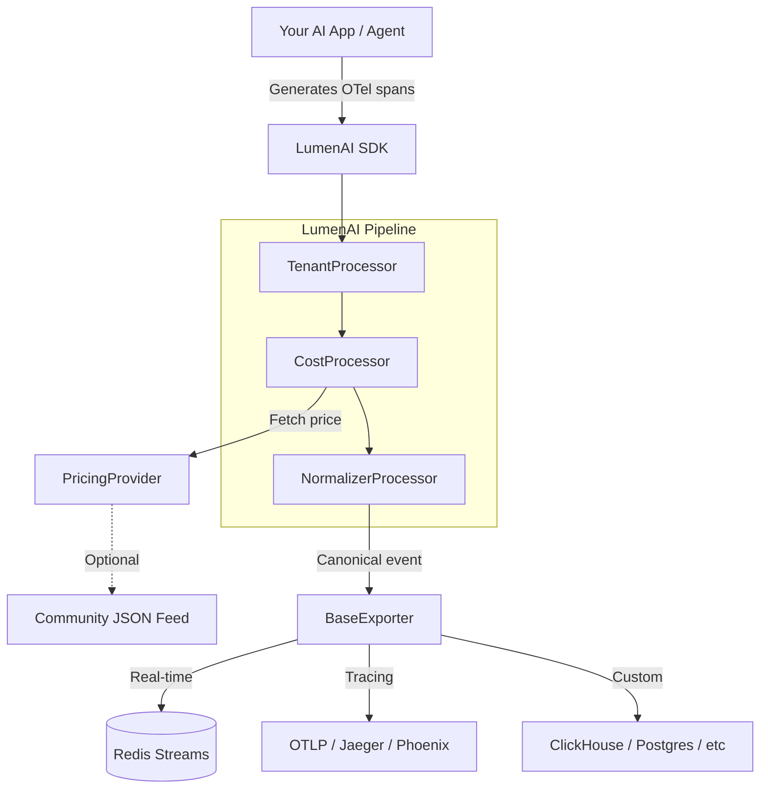
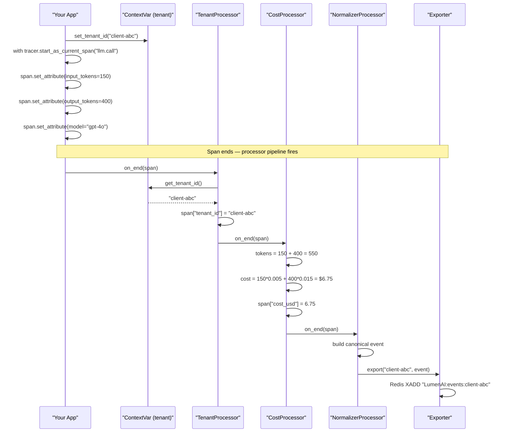
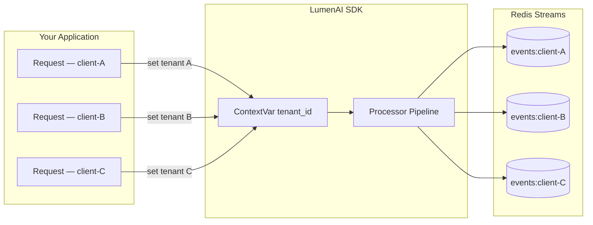
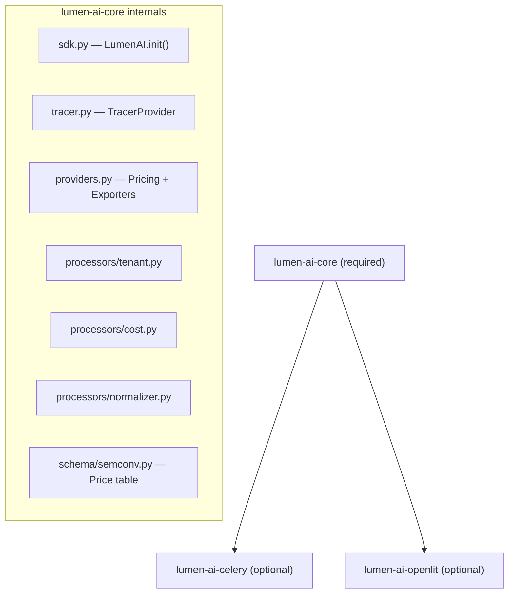

<div align="center">

# 🔦 LumenAI SDK

**Real-time FinOps & Observability for Generative AI**

[](https://github.com/skarL007/-lumen-ai-sdk)
[](LICENSE)
[](https://opentelemetry.io)
[](https://python.org)
[](https://github.com/sponsors/skarL007)

> *"Standard OTel tells you what broke. LumenAI shines a light on how much it cost and which client was using it."*

[Interactive Demo](https://skarL007.github.io/-lumen-ai-sdk/lumen-demo.html) · [Report a Bug](https://github.com/skarL007/-lumen-ai-sdk/issues) · [Become a Sponsor](https://github.com/sponsors/skarL007)

</div>

---

## The Problem

You launched an AI agent. Traffic grows. Then the OpenAI invoice arrives: **$2,000**. Who used it? Which tenant? Which model? You have no idea.

Standard OpenTelemetry gives you traces. It does not tell you how much each trace cost or which customer triggered it. **LumenAI fills that gap.**

---

## What is LumenAI?

LumenAI is a lightweight SDK that plugs into your existing OpenTelemetry pipeline and adds two critical layers that standard OTel does not provide:

- **Real-time FinOps** — USD cost calculated per span, per tenant, per model
- **Native multi-tenancy** — every trace is automatically tagged with the correct `tenant_id` using Python ContextVars, with zero changes to your existing code

---

## Architecture

### Full Pipeline



### Span Lifecycle — Step by Step



### Multi-Tenant Isolation



### Package Structure



---

## Installation

> The packages are not yet on PyPI. Install directly from the repository:

```bash
# Core package (required)
pip install "git+https://github.com/skarL007/-lumen-ai-sdk.git#subdirectory=packages/lumen-ai-core"

# Celery worker support (optional)
pip install "git+https://github.com/skarL007/-lumen-ai-sdk.git#subdirectory=packages/lumen-ai-celery"

# Zero-code LLM auto-instrumentation via OpenLIT (optional)
pip install "git+https://github.com/skarL007/-lumen-ai-sdk.git#subdirectory=packages/lumen-ai-openlit"
```

Once published to PyPI:
```bash
pip install lumen-ai-core
```

---

## Quick Start

### Minimal setup

```python
from lumen_ai import LumenAI

LumenAI.init(
    service_name="my-agent",
    redis_url="redis://localhost:6379/0",  # optional — real-time events
    default_tenant="anonymous"
)
```

### Full example with multi-tenancy

```python
from lumen_ai import LumenAI
from lumen_ai.tracer import get_lumen_tracer
from lumen_ai.tenant import set_tenant_id  # ContextVar helper

# 1. Initialize once at application startup
LumenAI.init(
    service_name="my-ai-saas",
    redis_url="redis://localhost:6379/0",
    default_tenant="anonymous",
)

tracer = get_lumen_tracer("my-module")

# 2. On each request — set the tenant context
def handle_request(user_tenant: str, prompt: str):
    set_tenant_id(user_tenant)  # propagates via ContextVar

    with tracer.start_as_current_span("llm.completion") as span:
        span.set_attribute("gen_ai.system", "openai")
        span.set_attribute("gen_ai.request.model", "gpt-4o")
        span.set_attribute("gen_ai.usage.input_tokens", 150)
        span.set_attribute("gen_ai.usage.output_tokens", 400)

        response = call_openai(prompt)

    # LumenAI calculates cost and publishes to Redis automatically
    return response
```

### Event published to Redis

After each span, LumenAI publishes to `LumenAI:events:{tenant_id}`:

```json
{
  "event_type": "llm.completion",
  "tenant_id": "client-abc",
  "model": "gpt-4o",
  "provider": "openai",
  "input_tokens": 150,
  "output_tokens": 400,
  "total_tokens": 550,
  "cost_usd": 6.75,
  "latency_ms": 1243,
  "timestamp": "2026-04-05T12:00:00Z",
  "service_name": "my-ai-saas",
  "trace_id": "abc123..."
}
```

---

## Pricing Providers

### Built-in table (default)

The SDK ships with prices for major models out of the box:

| Provider | Models |
|----------|--------|
| OpenAI | gpt-4o, gpt-4o-mini, gpt-4-turbo, gpt-3.5-turbo |
| Anthropic | claude-3-5-sonnet, claude-3-haiku, claude-3-opus |
| Google | gemini-2.5-pro, gemini-flash, gemini-flash-lite |
| DeepSeek | deepseek-v3, deepseek-r1 |
| Meta | llama-3.1-70b, llama-3.1-8b |

### Community Pricing Feed (dynamic)

Stay updated with the latest model price drops without redeploying:

```python
from lumen_ai.providers import CommunityPricingProvider
from lumen_ai.schema.semconv import PRICING_TABLE

pricing = CommunityPricingProvider(
    url="https://raw.githubusercontent.com/skarL007/-lumen-ai-sdk/LumenAI/community_prices.json",
    fallback_table=PRICING_TABLE  # uses built-in table if URL is unreachable
)

LumenAI.init(service_name="my-agent", pricing_provider=pricing)
```

### Custom pricing provider

```python
from lumen_ai.providers import BasePricingProvider

class MyPricingProvider(BasePricingProvider):
    def get_pricing(self, model: str) -> dict:
        # fetch from your database, internal API, etc.
        return {"input": 0.005, "output": 0.015, "cache_read": 0.001}

LumenAI.init(service_name="app", pricing_provider=MyPricingProvider())
```

---

## Exporters

### Redis (built-in)

```python
from lumen_ai.providers import RedisExporter

exporter = RedisExporter(
    redis_url="redis://localhost:6379/0",
    stream_prefix="LumenAI:events"  # one stream per tenant: LumenAI:events:{tenant_id}
)
```

### Custom exporter

```python
from lumen_ai.providers import BaseLumenAIExporter
import json

class PostgresExporter(BaseLumenAIExporter):
    def export(self, tenant_id: str, event: dict) -> None:
        db.execute(
            "INSERT INTO ai_events (tenant_id, data) VALUES (%s, %s)",
            (tenant_id, json.dumps(event))
        )

LumenAI.init(service_name="app", exporter=PostgresExporter())
```

---

## Integrations

### Celery — Background tasks (lumen-ai-celery)

```python
from lumen_ai import LumenAI
from lumen_ai_celery import CeleryInstrumentor

LumenAI.init(
    service_name="worker",
    redis_url="redis://localhost:6379/0",
    instrumentors=[CeleryInstrumentor()]
)
```

Every Celery task automatically generates a span with tenant and cost attached.

### OpenLIT — Zero-code auto-instrumentation (lumen-ai-openlit)

```python
from lumen_ai import LumenAI
from lumen_ai_openlit import OpenLITInstrumentor

LumenAI.init(
    service_name="app",
    redis_url="redis://localhost:6379/0",
    instrumentors=[OpenLITInstrumentor()]
)

# From this point on, ALL OpenAI/Anthropic/Gemini calls are
# instrumented automatically — no other code changes needed.
import openai
client = openai.OpenAI()
response = client.chat.completions.create(...)  # span generated automatically
```

---

## Use Cases

### 1. Per-tenant billing in AI SaaS

```python
import redis, json

r = redis.Redis.from_url("redis://localhost:6379/0")

def get_monthly_cost(tenant_id: str) -> float:
    total = 0.0
    for _, data in r.xrange(f"LumenAI:events:{tenant_id}"):
        event = json.loads(data["data"])
        total += event.get("cost_usd", 0)
    return total

print(f"Client ABC: ${get_monthly_cost('client-abc'):.4f} this month")
```

### 2. Budget guardrail — block agent when limit is reached

```python
from lumen_ai.tenant import set_tenant_id

MAX_DAILY_USD = 5.00

def run_agent(tenant_id: str, prompt: str):
    if get_today_cost(tenant_id) >= MAX_DAILY_USD:
        raise Exception(f"Daily budget of ${MAX_DAILY_USD} reached for {tenant_id}")

    set_tenant_id(tenant_id)
    # ... run agent
```

### 3. Real-time cost dashboard

```python
import redis, json

r = redis.Redis.from_url("redis://localhost:6379/0")

last_id = "0"
while True:
    messages = r.xread({"LumenAI:events:client-abc": last_id}, block=1000)
    for _, msgs in (messages or []):
        for msg_id, data in msgs:
            event = json.loads(data["data"])
            print(f"[{event['tenant_id']}] {event['model']} → ${event['cost_usd']:.6f}")
            last_id = msg_id
```

---

## Repository Structure

```
-lumen-ai-sdk/
├── packages/
│   ├── lumen-ai-core/              # Core SDK
│   │   └── src/lumen_ai/
│   │       ├── sdk.py              # LumenAI.init() — entry point
│   │       ├── tracer.py           # TracerProvider with processor pipeline
│   │       ├── providers.py        # BasePricingProvider, BaseExporter, RedisExporter
│   │       ├── models.py           # Canonical event data structures
│   │       ├── processors/
│   │       │   ├── tenant.py       # Injects tenant_id via ContextVar
│   │       │   ├── cost.py         # Calculates USD cost per span
│   │       │   └── normalizer.py   # Builds canonical event
│   │       └── schema/
│   │           └── semconv.py      # Price table + OTel semantic conventions
│   ├── lumen-ai-celery/            # Celery worker instrumentor
│   └── lumen-ai-openlit/           # OpenLIT auto-instrumentation bridge
├── lumen-ai-demo/
│   └── Dashboard.tsx               # React dashboard component
├── lumen-demo.html                 # Interactive demo (GitHub Pages)
├── .github/
│   ├── FUNDING.yml                 # GitHub Sponsors
│   └── workflows/
│       ├── ci.yml                  # Import + build check on every push
│       └── publish.yml             # Publish to PyPI on release
├── README.md
├── CONTRIBUTING.md
├── SECURITY.md
└── LICENSE
```

---

## Roadmap

- [ ] PyPI release (`pip install lumen-ai-core`)
- [ ] ClickHouse exporter
- [ ] PostgreSQL exporter
- [ ] Plug-and-play React dashboard (`lumen-ai-demo`)
- [ ] Streaming support (SSE / WebSocket token-level cost)
- [ ] Public Community Pricing Feed (JSON hosted on GitHub)
- [ ] LangChain integration
- [ ] CrewAI / AutoGen integration

---

## Contributing

Contributions are welcome! See [CONTRIBUTING.md](CONTRIBUTING.md).

The easiest way to contribute is **updating the pricing table** when new models are released:
- File: `packages/lumen-ai-core/src/lumen_ai/schema/semconv.py`
- Format: `"model-name": {"input": 0.000, "output": 0.000}`

---

## Support & Community

LumenAI is **free and open source**. If this SDK saves you money on your AI infrastructure, consider supporting the project:

**[Become a Sponsor](https://github.com/sponsors/skarL007)**

Direct contact:
- **Discord:** `skar1v9`
- **Instagram:** [@skar1v9](https://instagram.com/skar1v9)

---

## License

MIT © 2026 [skarL007](https://github.com/skarL007)
