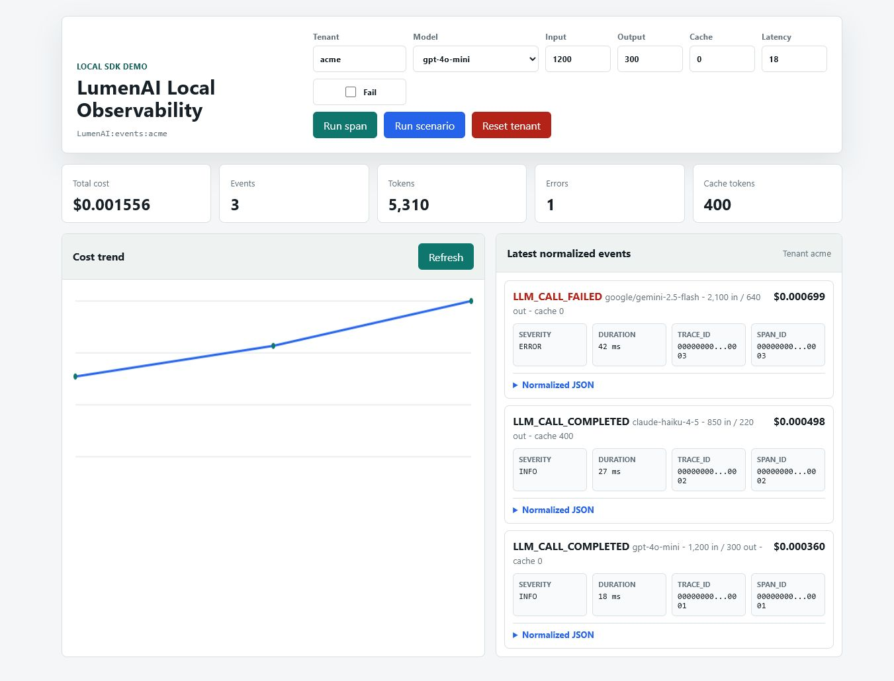

# LumenAI SDK

Metadata-only FinOps and observability for Generative AI workloads.

LumenAI is a Python OpenTelemetry extension that turns GenAI spans into tenant-aware cost and runtime events. It is built for teams that need to answer questions such as "which tenant caused this LLM cost spike?", "which model is producing the most errors?", and "which background task is driving token usage?" without exporting prompts, completions, tool arguments, or raw request bodies.



[](https://github.com/skarL007/-lumen-ai-sdk)
[](LICENSE)
[](https://www.python.org/)
[](https://github.com/skarL007/-lumen-ai-sdk/actions/workflows/ci.yml)

## Status

LumenAI is alpha software. The core SDK is usable for local evaluation, demos, and early integration work, but the public API can still evolve before v1.0.

Current readiness snapshot for the audited `0.1.4` source:

| Area | Status | Notes |
|---|---:|---|
| Core SDK behavior | Strong | Runtime lifecycle, tenant tagging, cost enrichment, event normalization, JSONL export, Redis export, and async Redis shutdown are covered by tests. |
| Tenant isolation | Strong | Tenant IDs are sanitized and propagated through context helpers, span attributes, Celery kwargs, and exporter stream keys. |
| Release gate | Strong locally | Local release gate builds wheel and sdist artifacts, runs `twine check`, clean installs both artifact types, and runs `pip check`. |
| Open source hygiene | Good | MIT license, security policy, contribution guide, issue templates, PR template, changelog, and release checklist are present. |
| PyPI availability | Pending | PyPI still serves `0.1.3`; this source tree is `0.1.4`. Use git or local checkout until publishing is complete. |
| Remote CI | Blocked externally | GitHub Actions currently fails before runners start because the account is locked due to billing. Local gates are the source of evidence until billing is restored. |
| Database migrations | Not included | Tenant-scoped SQLAlchemy constraints protect new schemas only. Existing databases need an explicit migration plan. |

## What LumenAI Does

LumenAI adds a three-processor chain to an OpenTelemetry `TracerProvider`:

```text
Your app
  |
  v
OpenTelemetry spans
  |
  v
TenantSpanProcessor
  - stamps every span with a tenant_id
  - stores tenant attribution by trace/span id
  |
  v
CostComputingSpanProcessor
  - reads model and token attributes
  - matches pricing
  - computes cost_usd
  |
  v
EventNormalizerProcessor
  - builds a canonical LumenAIEvent
  - sends the event to Redis, JSONL, or a custom exporter
```

It reads span metadata only:

- model name
- token counts
- cache-read token counts
- trace and span ids
- duration and status
- tenant id
- optional session, agent, and tool identifiers

It does not export:

- prompts
- completions
- tool arguments
- raw request or response bodies
- API keys
- user content

## Packages

| Package | Purpose | Install when |
|---|---|---|
| `lumen-ai-core` | Core OpenTelemetry processors, pricing, event schema, Redis exporters, JSONL exporter, tenant helpers | Always |
| `lumen-ai-celery` | Celery signal instrumentation for background task lifecycle spans | You run Celery workers |
| `lumen-ai-openlit` | Bridge that makes OpenLIT auto-instrumentation use the LumenAI tracer provider | You want provider/framework auto-instrumentation through OpenLIT |

## Installation

The audited source is `0.1.4`, but PyPI can still lag at `0.1.3` until the release workflow is executed. Until then, install from Git or from a local checkout.

Install from Git:

```bash
pip install "git+https://github.com/skarL007/-lumen-ai-sdk.git#subdirectory=packages/lumen-ai-core"
pip install "git+https://github.com/skarL007/-lumen-ai-sdk.git#subdirectory=packages/lumen-ai-celery"
pip install "git+https://github.com/skarL007/-lumen-ai-sdk.git#subdirectory=packages/lumen-ai-openlit"
```

Install from a local checkout:

```bash
git clone https://github.com/skarL007/-lumen-ai-sdk.git
cd -lumen-ai-sdk

pip install -e packages/lumen-ai-core
pip install -e packages/lumen-ai-celery
pip install -e packages/lumen-ai-openlit
```

After `0.1.4` is published, normal PyPI installation will be:

```bash
pip install lumen-ai-core
pip install lumen-ai-celery
pip install lumen-ai-openlit
```

## Quick Start: JSONL

Use JSONL for local development, examples, and smoke tests. It does not require Redis.

```python
from opentelemetry import trace

from lumen_ai import JsonlExporter, LumenAI, lumen_tenant
from lumen_ai.schema.semconv import (
    GenAIAttributes,
    OpenInferenceAttributes,
    SpanKind,
)

LumenAI.init(
    service_name="my-ai-app",
    exporter=JsonlExporter("lumen-events.jsonl"),
    default_tenant="anonymous",
)

tracer = trace.get_tracer("my-ai-app")

with lumen_tenant("client-acme"):
    with tracer.start_as_current_span("llm.chat") as span:
        span.set_attribute(OpenInferenceAttributes.SPAN_KIND, SpanKind.LLM)
        span.set_attribute(GenAIAttributes.OPERATION_NAME, "chat")
        span.set_attribute(GenAIAttributes.REQUEST_MODEL, "gpt-4o-mini")
        span.set_attribute(GenAIAttributes.USAGE_INPUT_TOKENS, 1200)
        span.set_attribute(GenAIAttributes.USAGE_OUTPUT_TOKENS, 300)

LumenAI.shutdown()
```

Each line in `lumen-events.jsonl` is one normalized metadata event.

Runnable example:

```bash
python examples/jsonl-smoke/main.py
```

## Quick Start: Redis

Use Redis Streams when you want tenant-namespaced event streams.

```python
from lumen_ai import LumenAI

LumenAI.init(
    service_name="my-ai-app",
    redis_url="redis://localhost:6379/0",
    default_tenant="anonymous",
)
```

Events are written to stream keys such as:

```text
LumenAI:events:client-acme
```

For high-throughput or latency-sensitive paths, prefer `AsyncRedisExporter` so Redis writes happen on a dedicated background event loop:

```python
from lumen_ai import AsyncRedisExporter, LumenAI

LumenAI.init(
    service_name="my-ai-app",
    exporter=AsyncRedisExporter("redis://localhost:6379/0", max_buffer=100),
    default_tenant="anonymous",
)
```

`LumenAI.shutdown()` drains buffered async Redis writes before closing the exporter.

## Tenant Context

For request-scoped code, use the context manager:

```python
from lumen_ai import lumen_tenant

with lumen_tenant("client-acme"):
    run_llm_call()
```

For framework middleware, use the token API:

```python
from lumen_ai import reset_tenant_id, set_tenant_id

token = set_tenant_id("client-acme")
try:
    run_request()
finally:
    reset_tenant_id(token)
```

Tenant ids are sanitized before they reach span attributes or exporter stream keys. Control characters are removed and IDs are capped to a bounded length to avoid corrupt logs or unbounded Redis key cardinality.

## Integrations

### FastAPI

Use middleware or dependencies to set a tenant before request handling and reset it in `finally`.

See [examples/fastapi-quickstart](examples/fastapi-quickstart).

### Celery

Pass `tenant_id` as a task kwarg so the Celery instrumentor can tag the task span:

```python
summarize.delay(tenant_id="client-acme", text="Summarize this...")
```

See [examples/celery-background-tasks](examples/celery-background-tasks).

### OpenLIT

Activate the bridge through `instrumentors` so OpenLIT uses the LumenAI tracer provider:

```python
from lumen_ai import JsonlExporter, LumenAI
from lumen_ai_openlit import OpenLITBridge

LumenAI.init(
    service_name="langchain-service",
    exporter=JsonlExporter("lumen-events.jsonl"),
    instrumentors=[OpenLITBridge()],
)
```

See [examples/langchain-cost-tracking](examples/langchain-cost-tracking).

## Local Demo

Run a no-key demo with a local dashboard:

```bash
cd examples/local-observability-demo
docker compose up --build
```

Open:

```text
http://localhost:8000
```

Or call the API directly:

```bash
curl -X POST http://localhost:8000/simulate \
  -H "Content-Type: application/json" \
  -d '{"tenant_id":"acme","model":"gpt-4o-mini","input_tokens":1200,"output_tokens":300}'

curl http://localhost:8000/events/acme
```

The static [lumen-simulation.html](lumen-simulation.html) file is kept as a visual prototype. It is not proof of SDK behavior.

## Event Contract

Exporters receive a `tenant_id` and a `LumenAIEvent` typed dict.

```python
class LumenAIEvent(TypedDict):
    id: str
    tenant_id: str
    session_id: str
    agent_id: str
    trace_id: str
    span_id: str
    timestamp: str
    event_type: str
    severity: str
    message: str
    duration_ms: int
    is_error: bool
    cost_usd: float
    tokens_in: int
    tokens_out: int
    cache_read_tokens: int
    model: str
    tool_name: str
    span_kind: str
```

The schema is intentionally metadata-only. It has no prompt, completion, request-body, response-body, or tool-argument fields.

## Public API

```python
from lumen_ai import (
    AsyncRedisExporter,
    BaseInstrumentor,
    JsonlExporter,
    LumenAI,
    LumenAIEvent,
    RedisExporter,
    clear_tenant_id,
    get_tenant_id,
    lumen_tenant,
    reset_tenant_id,
    set_tenant_id,
)
```

`LumenAI.init()` is a process-level singleton. Call it once during application startup and call `LumenAI.shutdown()` during graceful shutdown. Shutdown is idempotent and drains the active exporter at most once.

## Custom Exporters

Implement `BaseLumenAIExporter` to send events to another system:

```python
from lumen_ai.providers import BaseLumenAIExporter
from lumen_ai.schema.event_types import LumenAIEvent


class MyExporter(BaseLumenAIExporter):
    def export(self, tenant_id: str, event: LumenAIEvent) -> None:
        try:
            write_event(tenant_id, event)
        except Exception:
            # Exporters must not raise into the OpenTelemetry span pipeline.
            return

    def shutdown(self) -> None:
        flush_and_close()
```

Exporter rules:

- `export()` must not raise.
- Keep synchronous exporters fast.
- Buffer network writes for high-throughput paths.
- Implement `shutdown()` when the exporter owns resources.

See [examples/custom-exporter](examples/custom-exporter).

## Pricing

The default pricing provider uses the built-in table in `lumen_ai.schema.semconv`. Unknown models do not crash the pipeline. They preserve model and token metadata with `cost_usd=0.0`.

You can inject a custom pricing provider:

```python
from lumen_ai import JsonlExporter, LumenAI
from lumen_ai.providers import BasePricingProvider


class MyPricingProvider(BasePricingProvider):
    def get_pricing(self, model: str):
        return {"input": 0.15, "output": 0.60, "cache_read": 0.03}


LumenAI.init(
    pricing_provider=MyPricingProvider(),
    exporter=JsonlExporter("lumen-events.jsonl"),
)
```

Provider rules:

- `get_pricing()` must not raise.
- Return `None` for unknown paid models.
- Return zero-price dictionaries only for genuinely free models.
- Cache aggressively if pricing comes from a remote service.

## Development

Create an environment and install editable packages:

```bash
python -m venv .venv
.venv\Scripts\activate

python -m pip install --upgrade pip
pip install -e packages/lumen-ai-core
pip install -e packages/lumen-ai-celery
pip install -e packages/lumen-ai-openlit
pip install pytest pytest-cov fastapi httpx ruff mypy build twine pip-audit celery
```

Run the core gates:

```bash
python -m pytest tests -q
python -m ruff check packages/lumen-ai-core/src packages/lumen-ai-celery/src packages/lumen-ai-openlit/src --select E,F,W,I --ignore E501
python -m mypy packages/lumen-ai-core/src/lumen_ai --ignore-missing-imports --no-error-summary
```

Run the full release gate:

```bash
python scripts/release_gate.py
```

The release gate runs:

- pytest
- ruff
- mypy on `lumen_ai`
- wheel and sdist builds for all three packages
- `twine check`
- clean wheel install
- clean sdist install
- `pip check`
- public import verification

Benchmarks are opt-in:

```bash
set LUMEN_RUN_BENCHMARKS=1
python -m pytest tests/test_benchmark.py -v
```

On Linux/macOS:

```bash
LUMEN_RUN_BENCHMARKS=1 python -m pytest tests/test_benchmark.py -v
```

## Audit Harness

The repository includes a local audit harness for repeatable release evaluation:

```powershell
.\harness\scripts\run-audit.ps1 -Full
```

It produces:

- `harness/reports/audit-data.json`
- `harness/dashboard/index.html`
- `harness/reports/dashboard-screenshot.png`

The current harness score is `90/100`. The remaining findings are intentionally explicit:

- PyPI still serves `0.1.3` until `0.1.4` is published.
- SQLAlchemy tenant constraints protect new schemas only until migrations exist.
- `pip-audit` can audit dependencies, but not unpublished local package names themselves.

## Validation Snapshot

Last local validation for this audited source:

| Gate | Result |
|---|---|
| `python -m pytest tests -q` | `104 passed, 4 skipped, 1 warning` |
| Ruff package lint | Pass |
| Mypy core type check | Pass |
| `python scripts/release_gate.py` | Pass |
| `.\harness\scripts\run-audit.ps1 -Full` | Pass, score `90` |
| Runtime probes | Pass |
| Playwright dashboard check | Pass, `0` console errors |
| PyPI latest check | `0.1.3` currently published; source is `0.1.4` |
| Remote GitHub Actions | Blocked before runner startup by account billing |

Remote CI must be re-run after billing is restored before publishing or merging as a release branch.

## Release

Do not publish directly from a local machine. The intended path is GitHub Trusted Publishing through `.github/workflows/publish.yml`.

Before release:

1. Restore GitHub Actions billing so CI can start runners.
2. Run `python scripts/release_gate.py` locally.
3. Run `.\harness\scripts\run-audit.ps1 -Full`.
4. Confirm PyPI still lacks the target version.
5. Create and push tag `v0.1.4`.
6. Let the hardened publish workflow run the release gate before upload.

See [RELEASE_CHECKLIST.md](RELEASE_CHECKLIST.md).

## Security

Security model summary:

- LumenAI exports metadata only.
- Prompt and response content are not read or stored.
- Tenant IDs are caller-provided business identifiers.
- Redis stream names are tenant-namespaced.
- Processor and exporter exceptions are caught so telemetry failures do not crash the application.
- Remote pricing is opt-in and constrained by URL scheme and document size.

See [SECURITY.md](SECURITY.md) for vulnerability reporting and production hardening guidance.

## Storage Schema

The SQLAlchemy models include tenant-scoped composite constraints for new schemas so sessions, agents, events, artifacts, and approvals cannot be related across tenants by foreign key.

This release does not include Alembic migrations. Existing databases should be migrated explicitly or recreated in a controlled maintenance window before relying on those constraints.

## Known Limits

- Alpha API: public names are stable enough for early adopters, but not yet v1.
- PyPI can lag this source until `0.1.4` is published.
- Remote CI is blocked by account billing in the current PR state.
- Existing production databases need manual migration planning.
- The included dashboard is a local/demo dashboard, not a hosted SaaS control plane.
- Cost accuracy depends on current pricing data and correct model names in spans.

## Roadmap

- `0.1.4`: runtime lifecycle fixes, tenant sanitization, release hardening, examples, and audit harness.
- `0.2`: richer exporter examples, typed pricing provider docs, OpenLIT compatibility matrix, and clearer benchmark reporting.
- `0.3`: production dashboard example backed by Redis or ClickHouse.
- `1.0`: stable public API, migration guide, full security review, and production readiness checklist.

## Contributing

Contributions are welcome. Start with [CONTRIBUTING.md](CONTRIBUTING.md).

Useful first contributions:

- add or update model pricing with an official pricing source link
- improve examples for common frameworks
- add exporter examples for ClickHouse, Postgres, Kafka, or cloud queues
- expand OpenLIT/LangChain compatibility coverage
- add migration documentation for existing SQLAlchemy schemas

Before opening a PR:

```bash
python scripts/release_gate.py
```

For security issues, do not open a public issue. Follow [SECURITY.md](SECURITY.md).

## License

MIT. See [LICENSE](LICENSE).
